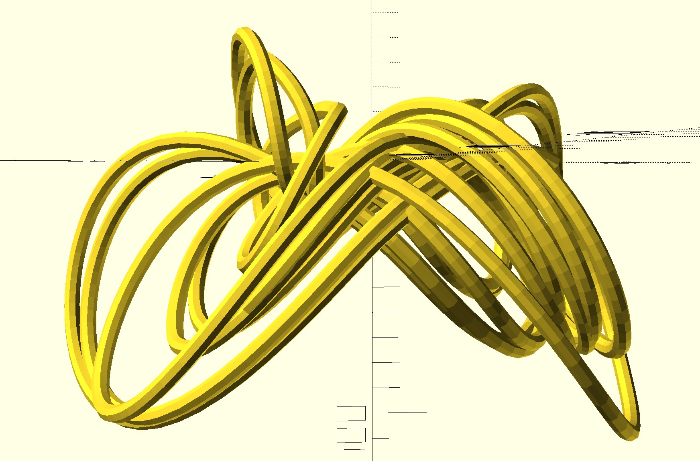

# 3d-printing-of-chaotic-attractor
Python port of the MATLAB file `runrucklidge.m` from "Modeling Dynamical Systems for 3D Printing”, Notices of the AMS, 2020 by Stephen K. Lucas, Evelyn Sander, and Laura Taalman (http://math.gmu.edu/~sander/EvelynSite/supplementary-materials-for.html)
     
    
Some features added in the port: 
1. dynamical system descriptions are encapsulated in `dynamical_system` base class.
2. arclength extension to the system equations are in `dynamical_system` base class, i.e. in the definition of the dynamical system inherited from the base class only the original system equations need to be defined.
3. use scipy `minimize` module rather than the secant method to find the time when a certain length of the trajectory curve is reached.
4. dynamical system is run from T0 to T once and the final state are used as the initial conditions for the data output to ensure the initial state is near the chaotic attractor.

## How to use
The main file is `run_dynamical_system.py`. Put both files `run_dynamical_system.py` and `dynamical_systems.py` in the same directory. Run the file `run_dynamical_system.py` to generate an output file of data points. 4 dynamical systems are initially defined in `dynamical_systems.py`: 
1. `chua_oscillator`
2. `rucklidge`
3. `nonauto_chaotic_system`
4. `rossler_hyperchaos`. 

I will add more in the future.

The hyperchaotic Rossler system (`rossler_hyperchaos`) is a 4-dimensional dynamical system, but only the first 3 coordinates of the state vector are saved to the data file. A periodically driven nonautonomous chaotic system `nonauto_chaotic_system` is also included.

To switch dynamical systems, change the line `system=nonauto_chaotic_system()` in `run_dynamical_system.py` to another system.

The data in the output file can replace the data in the OpenSCAD file [`sweep_rucklidge_self_contained.scad`](http://math.gmu.edu/~sander/research/3dprintingdynamics/sweep_rucklidge_self_contained.scad) in http://math.gmu.edu/~sander/EvelynSite/supplementary-materials-for.html and OpenSCAD can be used to generate an STL file for a 3d printer.

